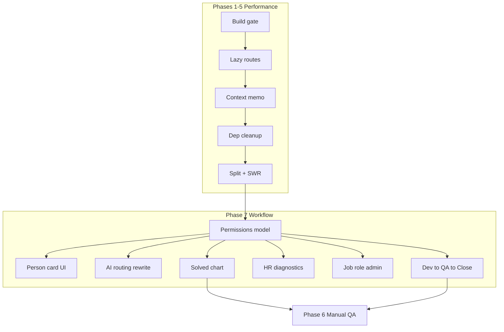

# Lumina Frontend Performance + Ticket Workflow Plan

## Preflight decision: Human review required

| Agent | Confidence | Risk | Recommendation |
|-------|------------|------|----------------|
| Eng | 8/10 | medium | revise |
| Design | 8/10 | medium | revise |
| QA | 8/10 | medium | revise |
| Security | 4/10 | medium | revise |

**Decision:** `human_in_loop` — min confidence **4/10** (pre-existing JWT-in-localStorage). Phase 7 adds **auth boundary changes** (permissions, reroute, job role edits) which security would flag as high risk — treat Phase 7 as a separate reviewed PR.

---

## Current state (relevant to new features)

| Area | Today | Gap |
|------|-------|-----|
| Reroute | Assignee only — [`canMutateTicket`](backend/lib/ticketPermissions.js) + frontend [`orgRoles.ts`](src/utils/orgRoles.ts) | Managers cannot reroute from list/detail |
| Comments | Backend: admin OR submitter only ([`comments.js`](backend/routes/comments.js)); frontend further restricts users | Org viewers cannot comment |
| Ticket view | Submitter, assignee, HR/managers ([`canViewTicket`](backend/lib/ticketPermissions.js)) | Other team members cannot view read-only |
| AI routing | [`buildRoutingSystemPrompt`](backend/lib/ticketRouting.js) defaults bugs → QA; payload omits `replication_steps` | Over-routes bugs to QA; incomplete context |
| Job role | HR can change system `role` (user/admin) via `PATCH /users/:id/role`; onboarding sets `job_title`/`department` once | No HR edit of job title/department after onboarding |
| Person card | Comment was `th-comment-avatar` shows initials only | No profile popover on click |
| HR analytics | SuperAdminDashboard has dept charts | No AI diagnostics report; no tickets-solved leaderboard |

**Recommended PR split:** PR1 = Phases 1–3; PR2 = Phases 4–5; **PR3 = Phase 7** (permissions + workflow — requires its own preflight/security review).

---

## Phase 1 — Build gate (required first)

**Goal:** `pnpm run build:frontend` passes cleanly.

| File | Fix |
|------|-----|
| [`src/utils/apiClient.ts`](src/utils/apiClient.ts) | Change `ticketsApi.list(params?: ... = {})` to `params: ... = {}` |
| [`src/utils/apiClient.ts`](src/utils/apiClient.ts) | Narrow `authApi.signup` to `{ email: string; password: string }` |
| [`src/pages/SuperAdminDashboard.tsx`](src/pages/SuperAdminDashboard.tsx
) | Explicit tab union type |
| [`src/pages/AdminDashboard.tsx`](src/pages/AdminDashboard.tsx), [`src/pages/UserDashboard.tsx`](src/pages/UserDashboard.tsx) | Wire or remove unused pagination/filter state |
| [`src/pages/TicketHistoryPage.tsx`](src/pages/TicketHistoryPage.tsx) | Remove unused imports |

**Exit criteria:** `tsc -b && vite build --mode hosting` succeeds.

---

## Phase 2 — Route code splitting

- Add [`src/routes/lazyPages.ts`](src/routes/lazyPages.ts) with shared lazy dashboard imports
- **Eager:** auth/setup routes (login, signup, verify-email, onboarding, pending-approval)
- **Lazy:** dashboards, ticket pages, profile, admin surfaces
- Wrap routes in `<Suspense fallback={<SetupLoading />}>` + chunk error boundary
- Lazy imports stay **inside** `<ProtectedRoute>`

---

## Phase 3 — Context provider stability

Memoize provider values in [`UserContext.tsx`](src/context/UserContext.tsx) and [`ToastContext.tsx`](src/context/ToastContext.tsx). Verify logout, 401, session timeout still propagate.

---

## Phase 4 — Bundle hygiene

Remove unused `react-icons` and `multer` from root [`package.json`](package.json).

---

## Phase 5 — TicketHistoryPage split + SWR

Split into `src/components/tickets/` (list, detail, comments, timeline). Add `@swr` for notifications → tickets → users/me. Use `useDeferredValue` for search.

**Note:** Phase 5 split should anticipate Phase 7 components (`UserProfileCard`, `SendToQaButton`, permission-aware action bar).

---

## Phase 7 — Ticket workflow & permissions (new)

### 7a. Permission model overhaul

Extend [`backend/lib/ticketPermissions.js`](backend/lib/ticketPermissions.js) and mirror in [`src/utils/orgRoles.ts`](src/utils/orgRoles.ts):

| Capability | Who |
|------------|-----|
| **View ticket (read-only)** | Submitter, assignee, any active admin with org/team scope |
| **Comment** | Anyone who can view the ticket |
| **Edit ticket details** (title, description, replication steps) | Assignee, managers (`department === 'Managers'`), HR |
| **Change status / priority** | Assignee; managers may override reroute-related status |
| **Reroute** | Assignee **OR** any manager (`isTeamManager`) |
| **Send to QA** | Assignee with developer job title / Developers department |
| **Close ticket** | Assignee; QA assignee after verification |

New helpers (backend + frontend):
- `canViewTicket` — expand to all admins (not only HR/managers org viewers)
- `canCommentOnTicket` — alias of `canViewTicket`
- `canEditTicketDetails(user, ticket)`
- `canRerouteTicket(user, ticket)` — assignee OR manager
- `canSendToQa(user, ticket)` — developer assignee, ticket not already with QA

Update enforcement in:
- [`backend/routes/tickets.js`](backend/routes/tickets.js) — status, priority, reroute, new PATCH for details
- [`backend/routes/comments.js`](backend/routes/comments.js) — replace admin/submitter check with `canCommentOnTicket`
- [`src/pages/TicketHistoryPage.tsx`](src/pages/TicketHistoryPage.tsx) — replace `canMutateSelected` / `canComment` / `canReroute` logic

### 7b. Person profile card on avatar click

**Trigger:** Click `.th-comment-avatar` in comment thread (and assignee avatars in list/detail).

**UI:** Popover/card (`UserProfileCard.tsx`) showing:
- Name, avatar, email
- `job_title`, `department`
- Open ticket count, recently resolved count
- Link to full profile if same org

**API:** `GET /api/v1/users/:id/summary` (new, auth required, returns public fields + workload stats). Enforce viewer can see user if they share ticket context or org scope.

**Files:** [`TicketCommentsPanel`](src/components/tickets/) (Phase 5 split), [`TicketHistoryPage.css`](src/pages/TicketHistoryPage.css) — make avatar `cursor: pointer`, keyboard accessible (`button` or `role="button"` + Enter).

### 7c. Rewrite AI routing prompt

**Problem:** [`buildRoutingSystemPrompt`](backend/lib/ticketRouting.js) line 238 routes all bugs → QA regardless of context.

**Changes in [`backend/lib/ticketRouting.js`](backend/lib/ticketRouting.js):**
1. Expand [`formatTicketForRouting`](backend/lib/ticketRouting.js) to include:
   - Full `description`
   - `replication_steps`
   - `metadata` (routing_intent, request_qa_testing)
   - Submitter department/job_title
2. Rewrite prompt rules:
   - Read **entire ticket** before deciding
   - Bug type ≠ automatic QA — route by **skill fit** (dev for code defects, QA for test verification / explicit qa_testing intent)
   - Only route to QA when: `routing_intent === 'qa_testing'`, user requested QA testing, or ticket is in verification phase
   - Production incidents / deploy issues → Platform/DevOps/SRE
   - Feature work → Software Engineer matching category
3. Update [`backend/tests/ticketRouting.test.js`](backend/tests/ticketRouting.test.js) with cases: software bug → developer, explicit qa_testing → QA, incident → platform

### 7d. Open comments + edit ticket details

**Backend:**
- `comments.js` POST: allow if `canCommentOnTicket`
- New `PATCH /tickets/:id/details` — body: `{ title?, description?, replicationSteps? }` guarded by `canEditTicketDetails`

**Frontend:**
- Show comment compose for all viewers (not gated on submitter/admin)
- Inline edit for title/description/replication steps when `canEditTicketDetails`
- Read-only fields for users with view-only access

### 7e. Developer → QA → Close workflow

**New actions:**

| Action | Actor | Effect |
|--------|-------|--------|
| **Send to QA** | Developer assignee | Set `metadata.routing_intent = 'qa_testing'`, call reroute with QA bias, status → `assigned` |
| **QA verified** | QA assignee | Status → `resolved` |
| **Close** | Assignee or manager | Status → `closed` |

**Backend:** `POST /tickets/:id/send-to-qa` — validates `canSendToQa`, sets routing intent, invokes `chooseAssignee` with QA-weighted assignee pool.

**Frontend:** Buttons in ticket detail action bar:
- "Send to QA" (dev assignee)
- "Mark verified" (QA assignee)
- "Close ticket" (assignee/manager when resolved)

Audit log actions: `ticket_sent_to_qa`, `ticket_qa_verified`.

### 7f. Manager reroute on list items

**Requirement:** Reroute button available to **all managers** on queue list items ([`.th-list-item`](src/pages/TicketHistoryPage.tsx)), not only when manager is assignee.

- Backend: relax reroute guard to `canRerouteTicket`
- Frontend: show reroute on list row quick actions when `isTeamManager(user)` OR assignee
- Keep disabled state + tooltip when neither applies

### 7g. HR AI performance diagnostics

**UI:** Button on [`SuperAdminDashboard`](src/pages/SuperAdminDashboard.tsx) (HR-only tab or header): **"Generate diagnostics"**

**Backend:** `POST /api/v1/reports/hr-diagnostics` (HR admin only)
- Aggregates: tickets resolved/closed by assignee, avg time-to-resolve, open workload by department, QA queue depth
- Sends summary to Lumina AI (reuse routing model config) for narrative report: developer performance, QA workload, bottlenecks
- Returns structured JSON + markdown report; cache last run timestamp

**Frontend:** Modal or panel showing report sections + export/copy. Loading/error/empty states required.

### 7h. Change job role (job title + department)

**Requirement:** HR can update a user's **job title and department** after onboarding (not just system `role`).

**Backend:** `PATCH /api/v1/users/:id/profile` (HR admin only)
- Body: `{ jobTitle?, department? }`
- Re-derive system `role` from department (same logic as onboarding in [`users.js`](backend/routes/users.js))
- Audit log: `user_profile_updated`

**Frontend:** User Directory tab in SuperAdminDashboard — edit row inline or modal for job title + department dropdown (Developers, QA, Managers, HR).

Existing `PATCH /users/:id/role` remains for system role (user/admin).

### 7i. Chart — most tickets solved

**Metric:** Count of tickets with status `resolved` or `closed` grouped by final assignee (or resolver from audit log).

**Backend:** `GET /api/v1/tickets/stats/solved-by-assignee?period=30d` — returns `[{ name, count, department }]`

**Frontend:** Recharts bar chart on AdminDashboard + SuperAdminDashboard overview:
- Title: "Most tickets solved"
- Filter: last 7 / 30 / 90 days
- Tooltip with assignee name + department

---

## Phase 6 — Manual test matrix (updated)

**Performance (Phases 1–5):** unchanged from prior plan.

**Workflow (Phase 7):**
- Manager (non-assignee) reroutes ticket from list and detail
- Developer assignee sends ticket to QA; QA receives assignment
- QA verifies → resolved → close
- Org admin views ticket read-only, adds comment
- Non-viewer cannot access ticket detail (403)
- Click comment avatar → profile card with correct user info
- Edit ticket title/description as manager; blocked for read-only viewer
- AI routing: software bug → developer (not QA); explicit QA request → QA
- HR generates diagnostics report; non-HR blocked
- HR updates user job title/department; role re-derived
- Tickets-solved chart shows correct counts

**Auth regression:** Session timeout, 401, ProtectedRoute still work after permission expansion.

---

## Out of scope

- JWT migration to httpOnly cookies (separate security effort)
- Next.js / RSC migration
- Virtualizing ticket lists

---

## Estimated effort

| Phase | Human | Agent |
|-------|-------|-------|
| 1 Build gate | 2–4 hrs | 1 hr |
| 2 Code splitting | 3–5 hrs | 2 hrs |
| 3 Context memo | 1 hr | 30 min |
| 4 Dep cleanup | 30 min | 15 min |
| 5 Split + SWR | 2–3 days | 4–8 hrs |
| **7 Workflow & permissions** | **3–5 days** | **1–2 days** |
| 6 Manual QA | 4–6 hrs | — |

**PR order:** 1 → 2 → 3 (perf foundation first; Phase 7 builds on Phase 5 ticket component split).
