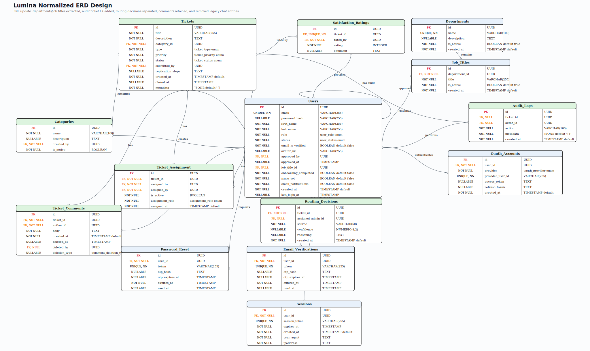

DATABASE SYSTEMS PROJECT REPORT

**Lumina**

AI-Powered Helpdesk and Issue Tracking Platform


| **Name**            | Yeddula Nachiketh Reddy                                                                                                                                  |
| ------------------- | -------------------------------------------------------------------------------------------------------------------------------------------------------- |
| **Student ID**      | 2523541                                                                                                                                                  |
| **GitHub**          | [Repository: soc-DBSP/react-nodejs-project1-NachikethReddyY](https://github.com/soc-DBSP/react-nodejs-project1-NachikethReddyY)                          |
| **DDL**             | [DDL.sql](https://github.com/soc-DBSP/react-nodejs-project1-NachikethReddyY/blob/main/backend/db/DDL.sql)                                                |
| **Seed Data**       | [seed.sql](https://github.com/soc-DBSP/react-nodejs-project1-NachikethReddyY/blob/main/backend/db/seed.sql)                                              |
| **Demonstration**   | In progress                                                                                                                                              |
| **Lucid Chart ERD** | [Lucid Chart ERD](https://lucid.app/lucidchart/d7d61fe3-ddef-4f76-abc5-c4e2bb971056/edit?invitationId=inv_d83dadf3-d00a-4177-8953-c1ea82ba3906&page=0_0) |


*Submitted for database design, implementation, and web development assessment.*

Date: May 28, 2026

**Table of Contents**

**1 Introduction**

1.1 Project Overview

1.2 Project Workflow

**2 Database Design**

2.1 Entity-Relationship Diagram (ERD)

2.2 Entities and Attributes

2.3 Data Integrity

**3 Database Implementation**

3.1 Implementation of Relationships

3.1.1 One-to-One (1:1) Relationships

3.1.2 One-to-Many (1:M) Relationships

3.1.3 Many-to-Many (N:M) Relationships

3.2 Creation of SQL Tables

3.3 Repository and Tooling Evolution

3.4 Sample Data and Queries

**4 Challenges Encountered and Solutions**

**5 Web Development**

5.1 Key Features Implemented

**Conclusion**

# 1 Introduction

## 1.1 Project Overview

Lumina is a full-stack internal helpdesk and issue-tracking platform built for organisations that need a structured, auditable way to manage support tickets from creation to closure. The project focuses on the complete ticket lifecycle: user registration, email verification, onboarding, HR account approval, ticket creation, category classification, priority selection, AI-assisted routing, ticket assignment, QA verification, developer handoff, comments, audit history, notifications, analytics, and HR-style performance reporting.

The application uses a Vite React TypeScript frontend, an Express backend, and PostgreSQL as the central data store. The database is not only used for storage; it drives the application rules. User roles, account statuses, email verification records, onboarding state, ticket records, active ticket assignments, comments, audit events, sessions, OAuth links, and password reset records are all represented directly in relational tables with constraints and indexes.

A major design goal is accountability. A requester can see the tickets they submitted, assigned users can see the tickets assigned to them, QA and developer assignments can be tracked separately, HR and managers can review organisational workload, and important changes are written to audit logs. This makes Lumina suitable as both a database systems project and a practical helpdesk application.

The current repository shows that Lumina became a complete full-stack project, not just a set of database tables. It includes OTP-based authentication, Google OAuth support, SMTP emails, avatar upload through Multer, Framer Motion UI animation, Recharts dashboards, generated six-month reporting data, configurable AI routing providers, server-side permission checks, and a pnpm workspace setup for running the frontend and backend together.

## 1.2 Project Workflow

Development progressed through several phases. The Git history shows the project starting from a React/Node foundation, then adding PostgreSQL integration, authentication, ticket APIs, UI redesigns, AI-assisted ticket routing, dashboard analytics, role cleanup, account governance, and final seed/reporting improvements.


| **Phase** | **Work completed**                                                                                                                                                                                             |
| --------- | -------------------------------------------------------------------------------------------------------------------------------------------------------------------------------------------------------------- |
| Phase 1   | Created the frontend foundation with Vite, React, TypeScript, a design system, auth screens, dashboard layout, and initial project documentation.                                                              |
| Phase 2   | Added the backend foundation: Express server, PostgreSQL connection, database DDL, authentication middleware, ticket API structure, and versioned `/api/v1` routes.                                            |
| Phase 3   | Implemented account flows: email/password signup, OTP verification, login, password reset, Google OAuth linking, onboarding, pending-user handling, and HR approval.                                           |
| Phase 4   | Built the ticket lifecycle: ticket creation, category/type/priority fields, comments, status transitions, AI-assisted ticket routing, ticket assignment records, developer/QA handoff, and audit logs.          |
| Phase 5   | Expanded dashboards and reporting: role-aware dashboards, organisation visibility, workload charts, HR reports, ticket closure analytics, and six months of historical seed data.                              |
| Phase 6   | Refined project operations: migrated earlier package-management work into the current pnpm workspace, split seed data from DDL, updated README/setup scripts, improved permissions, and polished the final UI. |


# 2 Database Design

## 2.1 Entity-Relationship Diagram (ERD)

The entity-relationship diagram models Lumina around users, tickets, categories, assignment history, comments, audit logs, authentication support tables, OAuth identity records, and sessions. The database is normalised so that each major concept has a clear table and relationship boundary.

**Lucid Chart ERD:** [Open Lucid Chart ERD](https://lucid.app/lucidchart/d7d61fe3-ddef-4f76-abc5-c4e2bb971056/edit?invitationId=inv_d83dadf3-d00a-4177-8953-c1ea82ba3906&page=0_0)



*Figure 1. Lumina database ERD from the project repository.*

## 2.2 Entities and Attributes

The current DDL defines ten main relational tables and one reporting view. The schema uses UUID primary keys, PostgreSQL enum types, JSONB metadata for flexible routing context, and timestamp fields for auditability.


| **Entity**          | **Purpose**                                                                                                                                                                                                          | **Key attributes**                                                                                                                                                                                                            |
| ------------------- | -------------------------------------------------------------------------------------------------------------------------------------------------------------------------------------------------------------------- | ----------------------------------------------------------------------------------------------------------------------------------------------------------------------------------------------------------------------------- |
| users               | Stores all account records, including login identity, role, status, email verification, profile details, department, onboarding state, notification preference, avatar URL, approval metadata, and login timestamps. | id, email, password_hash, first_name, last_name, role, status, email_is_verified, avatar_url, approved_by, approved_at, job_title, department, onboarding_completed, name_set, email_notifications, created_at, last_login_at |
| categories          | Lookup table for ticket classification. Categories can remain even if the user who created them is later deleted, because `created_by` uses `ON DELETE SET NULL`.                                                    | id, name, description, created_by, is_active                                                                                                                                                                                  |
| tickets             | Core helpdesk record. Stores issue content, category, type, priority, status, submitter, replication steps, closure time, and AI/routing metadata.                                                                   | id, title, description, category_id, type, priority, status, submitted_by, replication_steps, created_at, closed_at, metadata                                                                                                 |
| ticket_assignment   | Assignment history table. Allows a ticket to have an active assigned developer and an active assigned QA user while preserving older inactive assignment rows.                                                        | id, ticket_id, assigned_to, assigned_by, is_active, assignment_role, assigned_at                                                                                                                                              |
| audit_logs          | Append-only event trail for user actions, ticket changes, routing decisions, account events, and seeded login activity. Uses JSONB metadata for event-specific details.                                              | id, actor_id, action, metadata, created_at                                                                                                                                                                                    |
| ticket_comments     | Ticket discussion table. Supports soft deletion so removed comments can disappear from the interface without losing deletion metadata.                                                                               | id, ticket_id, author_id, body, created_at, deleted_at, deleted_by, deletion_type                                                                                                                                             |
| oauth_accounts      | Links third-party sign-in identities to Lumina users. Currently supports Google OAuth.                                                                                                                               | id, user_id, provider, provider_user_id, access_token, refresh_token, created_at                                                                                                                                              |
| email_verifications | Stores verification tokens and OTP hashes used during email/account activation.                                                                                                                                      | id, user_id, token, otp_hash, otp_expires_at, expires_at, used_at                                                                                                                                                             |
| password_reset      | Stores reset tokens and OTP hashes for account recovery.                                                                                                                                                             | id, user_id, token, otp_hash, otp_expires_at, expires_at, used_at                                                                                                                                                             |
| sessions            | Tracks server-side login sessions with expiry, user agent, and IP address.                                                                                                                                           | id, user_id, session_token, expires_at, created_at, user_agent, ipaddress                                                                                                                                                     |
| admin_workload view | Reporting view that aggregates open workload by admin user and priority.                                                                                                                                             | admin_id, email, first_name, last_name, priority counts, total_open, load_score                                                                                                                                               |


## 2.3 Data Integrity

Data integrity is enforced in the database as well as in the application code. This is important because users can only interact through the frontend, but the database still needs to reject invalid states if a request bypasses the UI or if a programming mistake is introduced.


| **Integrity mechanism** | **How it is used in Lumina**                                                                                                                                   |
| ----------------------- | -------------------------------------------------------------------------------------------------------------------------------------------------------------- |
| UUID primary keys       | Every table uses UUID identifiers generated with `pgcrypto`, preventing collisions and avoiding predictable integer IDs.                                       |
| Foreign keys            | Users, tickets, categories, comments, assignments, sessions, OAuth records, verification records, and reset records are connected through foreign keys.        |
| Enum types              | `user_role`, `user_status`, `ticket_type`, `ticket_priority`, `ticket_status`, `oauth_provider`, and `assignment_role` restrict stored values to known states. |
| Unique constraints      | User emails, OAuth provider identities, session tokens, verification tokens, and password reset tokens are unique.                                             |
| Partial unique indexes  | `idx_ticket_qa_assignment_unique` and `idx_ticket_dev_assignment_unique` enforce one active QA assignment and one active developer assignment per ticket.       |
| Delete rules            | User-owned operational rows cascade where appropriate. Audit log actor references use `ON DELETE SET NULL`, preserving history after account deletion.         |
| JSONB metadata          | Routing decisions and event details can be stored without changing the table structure each time the AI routing payload evolves.                               |
| Query indexes           | Status/priority, category, submitter, active assignment, token expiry, and audit-log indexes support fast dashboard and authentication queries.                |


# 3 Database Implementation

## 3.1 Implementation of Relationships

The schema uses one-to-one, one-to-many, and many-to-many patterns. Simple account and ticket relationships are implemented with foreign keys. The more complex ticket assignment model is implemented with a junction table so the system can represent current assignees and historical reassignment at the same time.


| **Relationship type**            | **Implementation**                            | **Explanation**                                                                                                                       |
| -------------------------------- | --------------------------------------------- | ------------------------------------------------------------------------------------------------------------------------------------- |
| Optional self-reference          | `users.approved_by -> users.id`               | A user can be approved by another user, normally an HR admin. The approving account may approve many users.                           |
| Optional one-to-one support data | `oauth_accounts.user_id -> users.id`          | Each OAuth account belongs to one Lumina account, while `provider_user_id` prevents the same Google identity from being linked twice. |
| One-to-many                      | `users.id -> tickets.submitted_by`            | One user can submit many tickets; each ticket has one submitter.                                                                      |
| One-to-many                      | `categories.id -> tickets.category_id`        | One category can group many tickets; each ticket belongs to one category.                                                             |
| One-to-many                      | `tickets.id -> ticket_comments.ticket_id`     | One ticket can have many comments; comments are deleted with the ticket.                                                              |
| One-to-many                      | `users.id -> sessions.user_id`                | One user can have multiple active or expired sessions.                                                                                |
| Many-to-many via junction        | `tickets <-> users through ticket_assignment` | Tickets can be assigned to different users over time, and each assigned user can work on many tickets.                                |


### 3.1.1 One-to-One (1:1) Relationships

Lumina uses optional one-to-one style records for account support flows. An OAuth account record belongs to one user, while the unique provider identity stops one Google account from being reused across multiple users. Email verification and password reset records also belong to one user and use unique token values so that verification and recovery links cannot collide.

Although `users.approved_by` is technically a self-referencing relationship rather than a strict one-to-one, it behaves like a single approval pointer on each account. This makes account governance simple: every approved user can store who approved them and when the approval happened.

### 3.1.2 One-to-Many (1:M) Relationships

One-to-many relationships form the backbone of the system. Users submit tickets, create comments, hold sessions, and appear in audit logs. Categories classify tickets. Tickets collect comments and assignments. These relationships are enforced with foreign keys, so the database will not allow orphaned comments, assignments, sessions, verification records, or reset records.

The delete behaviour is intentional. Deleting a user removes personal operational records where appropriate, but audit logs keep their historical event rows by setting `actor_id` to `NULL`. This protects reporting integrity while still allowing account cleanup.

### 3.1.3 Many-to-Many (N:M) Relationships

Ticket assignment is the most important many-to-many relationship. A ticket may move between assigned users over time, and each assignee may work on many tickets. Instead of storing a single `assigned_to` column directly on `tickets`, Lumina uses `ticket_assignment`.

This design gives the application three benefits:


| **Benefit**                         | **Result**                                                                                       |
| ----------------------------------- | ------------------------------------------------------------------------------------------------ |
| Separate QA and developer assignments | One active QA assignment and one active developer assignment can exist on the same ticket.      |
| Historical assignment tracking      | Older assignments are deactivated instead of deleted, preserving the handoff record.             |
| Strong current-state rules          | Partial unique indexes prevent duplicate active QA or developer assignments for the same ticket. |


## 3.2 Creation of SQL Tables

The DDL is implemented in `backend/db/DDL.sql`. It enables `pgcrypto`, creates enum types, creates tables, applies upgrade-safe `ALTER TABLE` statements for older databases, builds indexes, defines the `admin_workload` view, and inserts base development records needed by the seed file.


| **SQL object**       | **Implementation notes**                                                                                                                                                           |
| -------------------- | ---------------------------------------------------------------------------------------------------------------------------------------------------------------------------------- |
| Extension            | `CREATE EXTENSION IF NOT EXISTS "pgcrypto"` supports UUID generation and seeded password hashes using `crypt()` and `gen_salt()`.                                                  |
| Enums                | Role, status, ticket type, priority, ticket status, OAuth provider, and assignment role values are constrained in PostgreSQL.                                                      |
| Tables               | Ten core tables represent accounts, categories, tickets, assignments, audit logs, comments, OAuth, verification, password reset, and sessions.                                     |
| Upgrade-safe changes | The DDL includes `ALTER TABLE ... ADD COLUMN IF NOT EXISTS` and `DO $$ ... $$` blocks so older local databases can be brought closer to the current schema.                        |
| Indexes              | Indexes support common filters: active categories, users by role/status, tickets by submitter/category/status/priority, active assignment lookup, token expiry, and audit history. |
| Reporting view       | `admin_workload` calculates priority counts, open-ticket totals, and a weighted load score for active admin users.                                                                 |
| Seed separation      | Base users/categories live in the DDL; heavier ticket-domain demo data lives in `backend/db/seed.sql`.                                                                             |


## 3.3 Repository and Tooling Evolution

The Git history shows several implementation milestones that shaped the final project:


| **Repository evidence**      | **What changed**                                                                                                                                                                                                                                                                                 |
| ---------------------------- | ------------------------------------------------------------------------------------------------------------------------------------------------------------------------------------------------------------------------------------------------------------------------------------------------ |
| Early commits                | React frontend, design system, auth pages, dashboard shell, PostgreSQL connection, and Express backend setup were introduced.                                                                                                                                                                    |
| Backend feature commits      | Ticket APIs, AI routing trigger, nested dashboards, Fallow/code-quality cleanup, Vercel deployment configuration, and SQL query logging were added.                                                                                                                                              |
| Package-management evolution | Earlier work included npm/Bun-style root workflows and an npm lockfile. A later commit explicitly migrated the workspace from npm to pnpm, and the current `package.json` declares `pnpm@11.1.2`. The final commands therefore use `pnpm install`, `pnpm dev`, `pnpm db:init`, and `pnpm build`. |
| Data split                   | The latest commit extracts heavy seed data into `backend/db/seed.sql`, leaving `DDL.sql` responsible for schema and base fixtures.                                                                                                                                                               |
| Role and workflow refinement | Later commits removed the old `super_admin` role, aligned organisation roles around `user` and `admin`, separated HR/manager/developer/QA behaviour through department rules, and tightened who can approve, suspend, view directories, route, or mutate tickets.                                |


This history matters because the final report should match the current repository, not an older intermediate state. The current project is a pnpm workspace with both the root frontend and `backend/` package managed together through `pnpm-workspace.yaml`.

## 3.4 Sample Data and Queries

The project includes realistic seed data for demonstration and reporting. `DDL.sql` inserts schema-adjacent base records, including system, pending, HR, manager, developer, QA, and regular-user accounts. `seed.sql` adds the ticket-heavy demo dataset.


| **Seed area**             | **Content**                                                                                                               |
| ------------------------- | ------------------------------------------------------------------------------------------------------------------------- |
| Base users and categories | HR, manager, developer, QA, regular-user, pending-user, and Lumina AI system accounts, plus eight IT helpdesk categories. |
| Ticket history            | Six months of generated tickets from December 2025 through May 28, 2026, plus curated sample tickets for demonstration.   |
| Assignments               | Historical and active ticket assignments distributed across HR, managers, developers, and QA users.                       |
| Comments and audit logs   | Realistic comments and audit events make the timeline, activity panel, and reporting views meaningful.                    |
| Sessions and OAuth        | Seeded sessions and an OAuth account support authentication and account-management demonstration screens.                 |


The SQL queries below represent the key reporting and verification queries used in the project.

### Active tickets by status and priority

```sql
SELECT status, priority, COUNT(*) AS ticket_count
FROM tickets
WHERE status IN ('open', 'assigned', 'in_progress', 'on_hold', 'pending_routing')
GROUP BY status, priority
ORDER BY status, priority;
```

### Current assignee workload

```sql
SELECT email, first_name, last_name, total_open, load_score
FROM admin_workload
ORDER BY load_score DESC, total_open DESC;
```

### Ticket ageing for reporting graph

```sql
SELECT
  DATE_TRUNC('month', created_at) AS month,
  COUNT(*) AS created,
  COUNT(*) FILTER (WHERE status IN ('resolved', 'closed')) AS completed
FROM tickets
GROUP BY month
ORDER BY month;
```

### Tickets with both developer and QA assignments

```sql
SELECT
  t.title,
  dev_user.email AS developer,
  qa_user.email AS qa
FROM tickets t
JOIN ticket_assignment dev
  ON dev.ticket_id = t.id
 AND dev.is_active = TRUE
 AND dev.assignment_role = 'developer'
JOIN users dev_user ON dev_user.id = dev.assigned_to
JOIN ticket_assignment qa
  ON qa.ticket_id = t.id
 AND qa.is_active = TRUE
 AND qa.assignment_role = 'qa'
JOIN users qa_user ON qa_user.id = qa.assigned_to
ORDER BY t.created_at DESC;
```

# 4 Challenges Encountered and Solutions

Building Lumina as both a database-focused academic project and a working full-stack application required several design decisions. The biggest challenges were not only about creating tables, but about making the database model support realistic product behaviour.


| **Challenge**                                                          | **Solution**                                                                                                                                                                                                                            |
| ---------------------------------------------------------------------- | --------------------------------------------------------------------------------------------------------------------------------------------------------------------------------------------------------------------------------------- |
| Modelling QA and developer assignments without losing assignment history | Used `ticket_assignment` as a junction/history table with `assignment_role`, `is_active`, and partial unique indexes. This supports QA/developer pairing while keeping previous assignments.                                          |
| Avoiding role leakage after removing `super_admin`                     | Simplified the database role enum to `user` and `admin`, then used department-aware backend helpers for HR, manager, developer, and QA behaviour. This keeps the database role model simple while preserving real workflow differences. |
| Keeping reports realistic                                              | Added a dedicated `seed.sql` with hundreds of historical tickets across six months, realistic assignment distribution, comments, audit logs, and a small active queue. This makes dashboards useful for demonstration.                  |
| Preserving audit history during account deletion                       | Applied cascading deletes to personal operational rows and `ON DELETE SET NULL` to audit-log actors. Categories can also survive creator deletion through nullable `created_by`.                                                        |
| Handling avatar uploads safely                                         | Used Multer disk storage in `backend/routes/users.js`, limited uploads to image MIME types and 5 MB, stored files under `backend/uploads/avatars`, and served them through the Express `/uploads` static route.                         |
| Making AI routing reliable in local demos                              | Routing metadata is stored in ticket JSONB, while the backend supports configurable AI providers and deterministic fallback behaviour so ticket routing does not depend entirely on one external service.                               |
| Managing frontend/backend tooling                                      | The project evolved through earlier npm/Bun-style scripts and was later standardised as a pnpm workspace. This reduced setup friction because one root command can install dependencies and run both API and Vite dev servers.          |
| Preventing unauthorised ticket mutations                               | Permission logic was moved into backend helpers such as `teamScope` and `ticketPermissions`, so frontend hiding is supported by server-side enforcement.                                                                                |


# 5 Web Development

Lumina is a full-stack web application rather than a database-only submission. The frontend is built with Vite, React 19, TypeScript, React Router, Framer Motion, Recharts, Lucide React, Google OAuth components, an OTP input package, and a reusable component structure. The backend uses Node.js, Express 5, PostgreSQL through `pg`, JWT authentication, Nodemailer, Google OAuth verification, Multer uploads, and environment-profile loading.

The root project is organised as a pnpm workspace. The root package controls the Vite frontend and shared scripts, while `backend/package.json` controls the Express API. The main development command is `pnpm dev`, which uses `concurrently` to run the backend and frontend together. Database commands such as `pnpm db:init`, `pnpm db:refresh`, and `pnpm db:seed` load the schema and demo data through PostgreSQL's `psql` CLI.

Framer Motion is used throughout the user interface to make screen transitions and modal interactions feel smoother. It appears on the home page, login/signup/reset/verify pages, onboarding flow, pending approval page, dashboards, ticket history screen, profile page, account settings, toast notifications, delete-user modal, and chart containers. The animations are not part of the database model, but they improve the usability of multi-step flows such as login, OTP verification, onboarding, password reset, and avatar cropping.

Multer is used on the backend for profile avatar uploads. The upload route accepts a single `avatar` file, validates that the file is an image, enforces a 5 MB file-size limit, writes the file into `backend/uploads/avatars`, updates `users.avatar_url`, and returns the new asset path. The frontend uses this in onboarding and profile settings, including image preview/cropping before upload.

## 5.1 Key Features Implemented


| **Feature**                    | **Implementation summary**                                                                                                                                                                                                               |
| ------------------------------ | ---------------------------------------------------------------------------------------------------------------------------------------------------------------------------------------------------------------------------------------- |
| Authentication and onboarding  | Email/password signup, OTP verification, login, password reset, Google OAuth linking, onboarding fields, profile completion, session records, and pending-approval handling.                                                             |
| Role-aware access control      | Frontend protected routes and backend middleware enforce role and onboarding requirements. Department-aware helpers distinguish HR, managers, developers, and QA within the simplified `user`/`admin` database role model.               |
| Ticket lifecycle               | Users can create tickets with category, type, priority, description, and replication steps. Assigned users and authorised managers can view queues, assign, reroute, update status, comment, resolve, close, and review ticket history.   |
| QA/developer workflow          | A ticket can have both active QA and developer assignments through `ticket_assignment`. The backend supports routing to QA, routing to developer, paired handoff, and rerouting to another QA assignee.                                  |
| AI-assisted routing            | `backend/lib/ticketRouting.js` supports configurable providers such as Groq, Gemini, OpenRouter, and OpenCode. Routing decisions are stored in `tickets.metadata`, and fallback routing keeps assignment working when AI is unavailable. |
| Dashboards and analytics       | Recharts visualisations show throughput, ticket status mix, priority load, ageing risk, ticket volume, headcount, tickets by department, closure analytics, and top resolved-ticket performers.                                          |
| HR reporting                   | `backend/lib/hrReport.js` generates HR-style reports using seeded ticket performance data, workload metrics, and Chart.js-powered HTML output.                                                                                           |
| Notifications and auditability | The system records important account and ticket events in `audit_logs` and exposes notification/routing information through API routes and dashboard panels.                                                                             |
| Avatar/profile management      | Profile and onboarding screens support user details, department/job title, avatar upload, image crop UI, and server-side persistence.                                                                                                    |
| Error and session handling     | Custom 404/500 pages, pending-approval flow, idle-session timeout, protected route checks, token refresh, and consistent API error handling improve reliability.                                                                         |
| Deployment preparation         | Vite build scripts, Vercel rewrite guidance, profile-based environment loading, CORS configuration, and README setup instructions support local and hosted use.                                                                          |


# Conclusion

Lumina is a complete database-backed helpdesk application. It demonstrates database design through normalised entities, enforced relationships, enum types, indexes, partial unique indexes, JSONB routing metadata, and a reporting view. It demonstrates implementation through Express routes, PostgreSQL queries, seed scripts, audit logging, authentication flows, ticket workflows, and role-aware dashboards.

The project also shows clear web-development depth. The React frontend provides a polished user experience with Framer Motion animations, Recharts dashboards, protected routing, profile management, OTP screens, and ticket workbenches. The Express backend handles API routing, JWT auth, Google OAuth, SMTP emails, Multer avatar uploads, AI-assisted routing, permission checks, and static upload serving.

Overall, Lumina meets the required database design, database implementation, sample data, and web development components. It also leaves room for future improvement, including production deployment, a completed demonstration video, stronger automated backend tests, expanded AI routing evaluation, and optional enterprise identity-provider integration.
